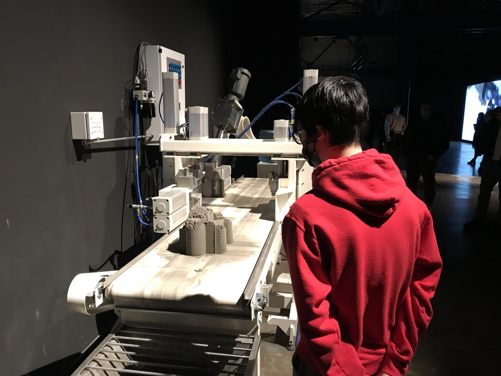
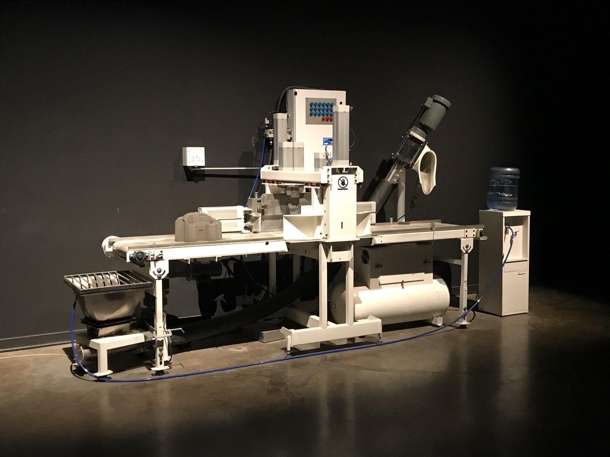
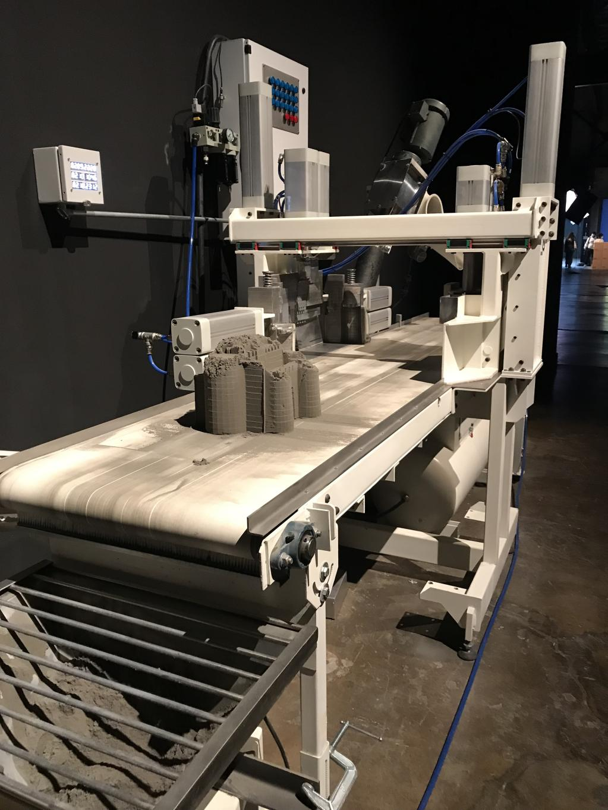
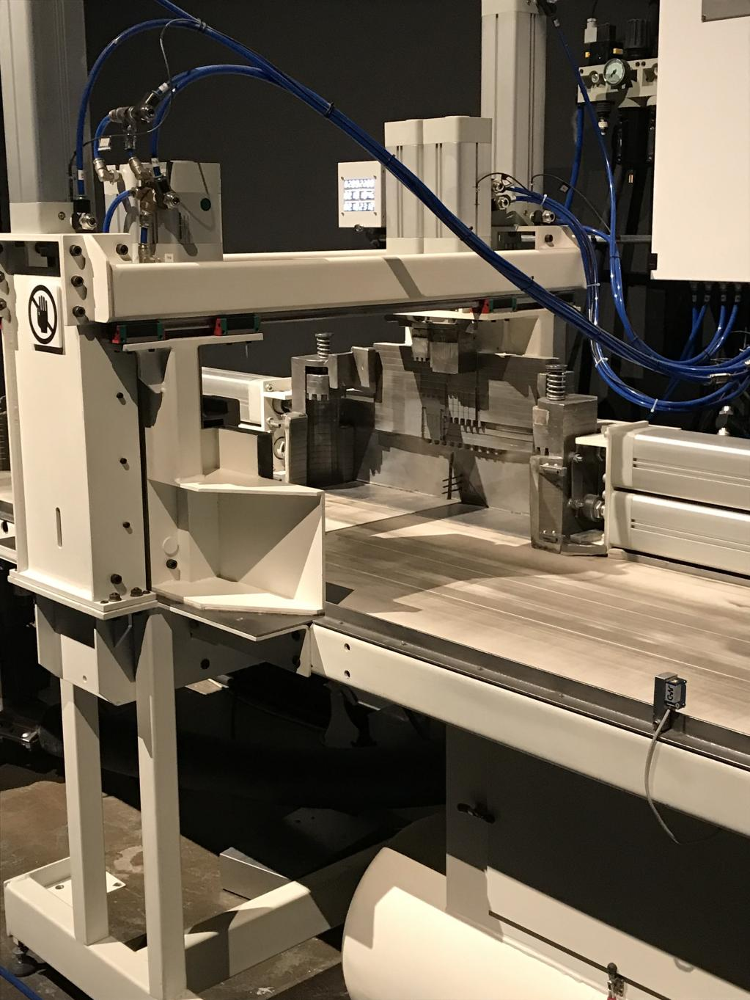
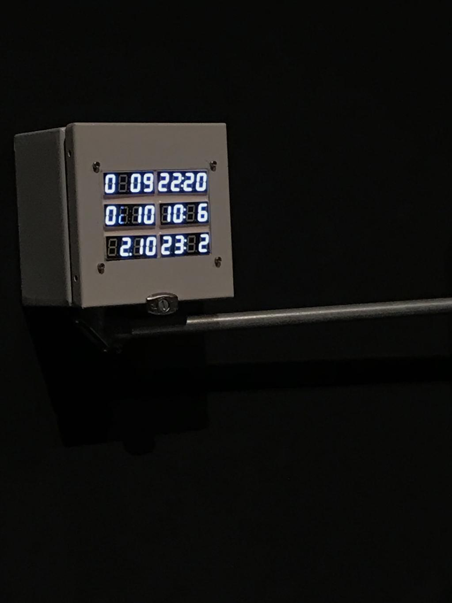
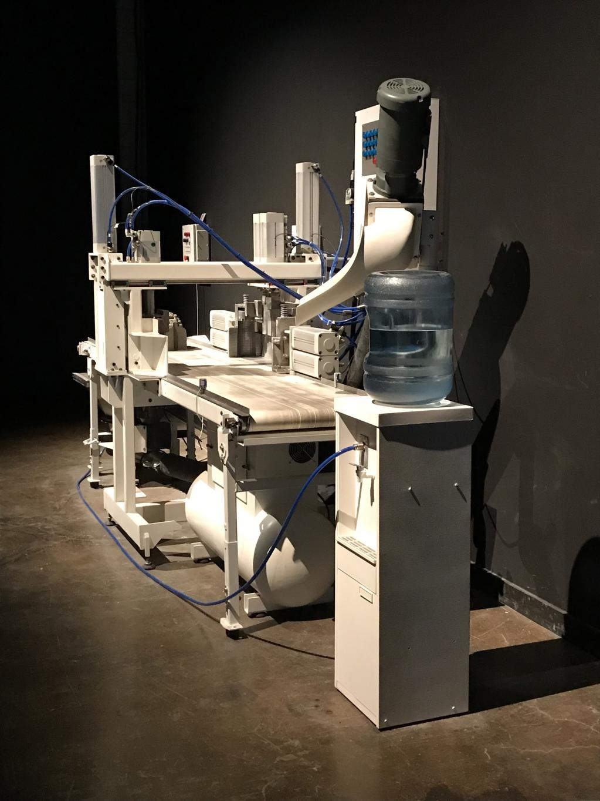
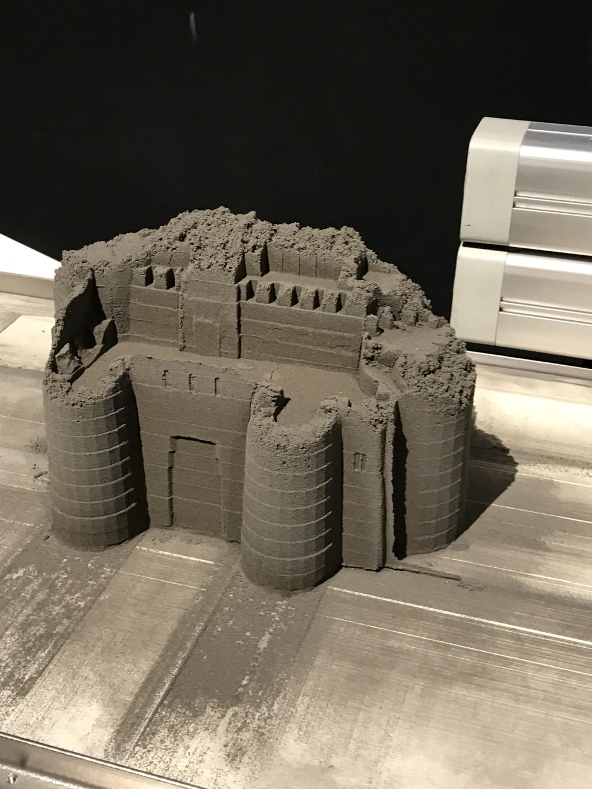

# Le château de sable

  ## Nom de l'artiste ou de la firme

Michel de Broin

  ## Année de réalisation

2015

  ## Nom de l'exposition ou de l'événement

Biennale Art Numérique

  ## Lieu de mise en exposition

Montréal, Québec, L'Arsenal

  ## Date de votre visite

9 Février 2022

  ## Description de l'oeuvre ou du dispositif multimédia 

Le château de sable est une oeuvre qui consiste d'une machine qui construit des châteaux de sables et les recycle à la fin du tapis roulant, où le cycle continue infiniment. La machine est constituée de convoyeurs, de pneumatique, un moule en acier inoxydable, une horloge de marées, d'automatisation et un capteur. Le commencement du cycle est déterminé par une horloge qui est activé par la position de la lune dans le ciel, qui influence les marées. Quand l'horloge déclenche le méchanisme, la machine va commencer par faire tomber du sable mouillé du tube sur le convoyeur et le déplacer lentement vers le moule en acier. Ceci va délicatement compresser le sable dans la forme d'un château et le faire déplacer proche du conteneur de collection, où il va attendre pour que le cycle recommence.

  ## Explications sur la mise en espace de l'oeuvre ou du dispositif

La machine est posée contre un mur avec deux projecteurs qui l'illumine. Parfois, il y aura un employé qui va passer pour nettoyer le sable du moule.

  ## Liste des composantes et techniques de l'oeuvre ou du dispositif

Convoyeurs, pneumatiques, moule en acier inoxydable, une horloge de marées, d'automatisation et capteurs.

  ##  Liste des éléments nécessaires pour la mise en exposition
  
De l'éléctricité, de l'eau, du sable, de l'espace et de la maintenance de temps en temps.

  ##  Expérience vécue:

  ### Description de votre expérience de l'oeuvre ou du dispositif, de l'interactivité, des gestes à poser, etc.

J'ai vécu une expérience assez intéressante puisque c'est la première fois que je vois de l'art en personne qui est si élaborée que ça. Il y a quelque chose qui m'intrigue avec des machines qui manufacturent des choses, notamment ceux qui sont dans des usines. Le fait que le dispositif faisait essentiellement une tâche inutile a été assez comédique pour moi.

  ### ❤️ Ce qui vous a plu, vous a donné des idées et justifications

Ce que j'ai aimé le plus avec cette oeuvre c'est que la machine était dans un cycle éternel à faire une tache inutile. Je trouve qu'il y a un aspect comédique avec des machines inutiles, comme si c'était un enfant qui faisant n'importe quoi. Je pense qu'il y a beaucoup de potentiel à ce sujet.

  ###  🤔 Aspect que vous ne souhaiteriez pas retenir pour vos propres créations ou que vous feriez autrement et justifications
 
 Si je faisait un projet de ce même genre, j'aurais mis un bouton pour que les visiteurs peuvent l'activer quand ils veulent au lieu d'une horloge qui s'active à des moments très précis parce que sinon, la machine ferait rien pour la majorité du temps et il se peut que les visiteurs ne savent pas que il y a un mécanisme.
 
 
 
  ## Références
  
  https://micheldebroin.org/fr/works/les-chateaux-de-sable/
