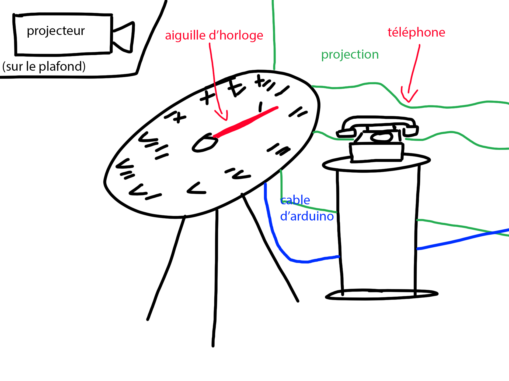
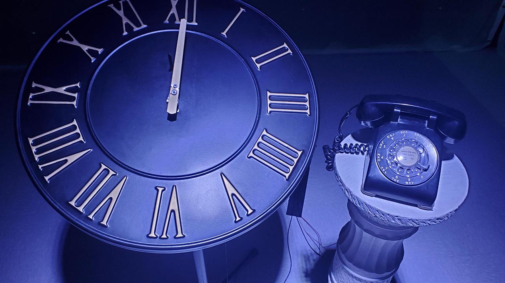
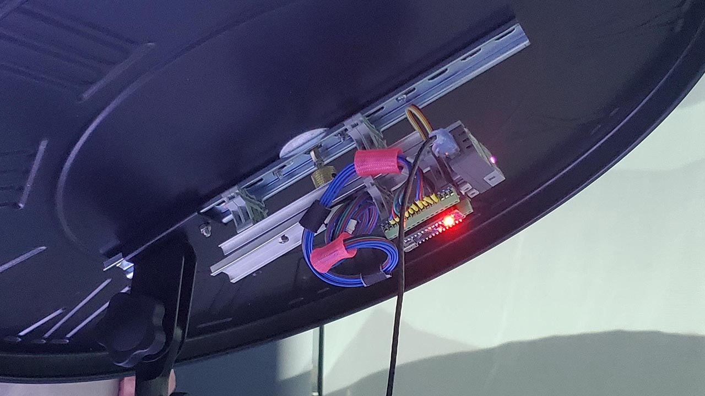
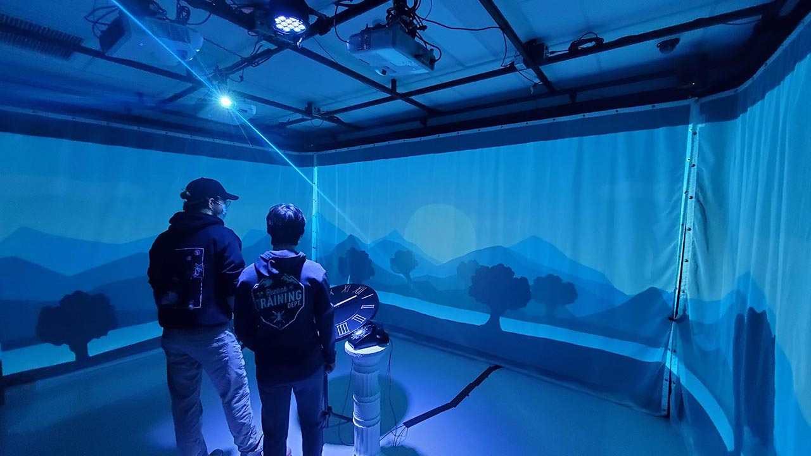
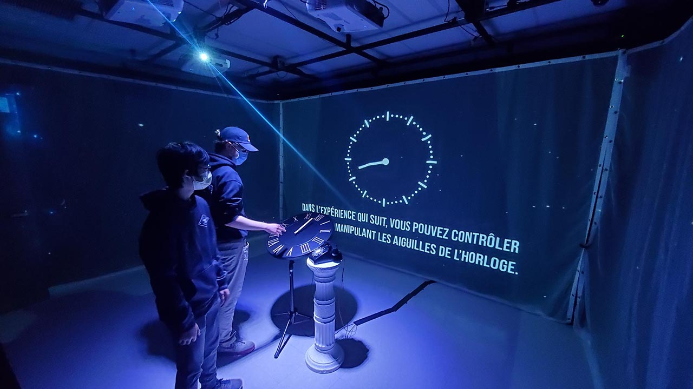

  # Titre de l'oeuvre ou de la réalisation

  ## L'Horloge de l'Apocalypse
  
  

  ## Nom de l'artiste ou de la firme
  
  Maxime Sabourin, Louis-Philippe Gravel, Alexis Lacasse, Tristan Girard-Montpetit et Maxime De Falco
  

  ## Année de réalisation
  
  2022

  ## Nom de l'exposition ou de l'événement
  
  Moebius

  ## Lieu de mise en exposition
  
  Le grand studio dans le collège Montmorency

  ## Date de votre visite
  
  23 Mars 2022

  ## Description de l'oeuvre ou du dispositif multimédia 
  
  L'oeuvre s'agit d'une horloge, d'un téléphone et d'un projecteur avec des haut-parleurs dans le petit studio. Lorsqu'on tourne les aiguilles de l'horloge, l'entourage et la musique changent. Ça commence calme dans la nature et fini avec la fin de la civilization humaine causé par la guerre nucléaire. À minuit, le téléphone sonne, nous disant de passer à l'action et les caméras font en sorte qu'on se voit sur les murs.
  
  
  
  [Source](https://github.com/MALT5/L-horloge-de-l-apocalypse)

  ## Explications sur la mise en espace de l'oeuvre ou du dispositif
  
  L'horloge est sur un trépied à coté du téléphone posé sur un piedestal. Un projecteur sur le plafond nous indique ce qu'il faut faire. Les haut parleurs sur les cotés jouent de la musique ou une voix et les caméras sont pour projeter la visiteurs sur les murs.
  
  [Source](https://github.com/MALT5/L-horloge-de-l-apocalypse)

  ## Liste des composantes et techniques de l'oeuvre ou du dispositif (ex. : réalité virtuelle, projecteurs, caméra USB, anneau lumineux...)
  
  Projecteur, haut parleur, caméras, lumière, arduino/raspberry pi
  
  
  
  [Source](https://github.com/MALT5/L-horloge-de-l-apocalypse)

  ##  Liste des éléments nécessaires pour la mise en exposition (ex. : crochets, sac de sable, câbles de soutien...)
  
  Éléctricité, de l'espace, rideaux, téléphone, horloge
  
  [Source](https://github.com/MALT5/L-horloge-de-l-apocalypse)

  ##  Expérience vécue:

  ### Description de votre expérience de l'oeuvre ou du dispositif, de l'interactivité, des gestes à poser, etc.

  Pour que l'oeuvre fonctionne comme il faut, il faut écouter l'annonceur et intéragir seulement quand il le dit. Quand on tourne l'aiguille de l'horloge, une scène différente va apparaître sur le mur. le plus tard on est dans la journée, le plus chaotique l'environnement devient. À minuit, le téléphone sonne et quand on le prend, une personne nous dit de passer à l'action.
  
  

  ### ❤️ Ce qui vous a plu, vous a donné des idées et justifications
  
   Je suis impressioné par la fluidité des transitions entre chaque scène, on peut rapidement changer l'aiguille de position et il n'y aura pas de bug. Comme pour L'En Deçà de Béchard Hudon, c'est une idée que je trouve très originale pour l'intéractivité.

  ###  🤔 Aspect que vous ne souhaiteriez pas retenir pour vos propres créations ou que vous feriez autrement et justifications
  
  Il n'y a pas vraiment d'aspect que je n'ai pas aimé, je trouve que ce projet a parfaitement été éxécuté.

  ## les projets ordonnés selon mes préférences après avoir visité

  1- **L'horloge de l'apocalypse**: Les aiguilles qui changent ce qui est projeté était très impressionant

  2- **Jeu temporel**: Le jeu était très fluide et était assez drôle vers la fin avec les questions rhétorique

  3- **Chronaufrage**: Les animations sont très fluides avec les capteurs et les illustrations sont agréable à observer

  4- **3 Minutes**: Le VR était bon mais avait quelque problèmes avec les capteurs du casque et les mannettes. Le casier était bien éxécuté

  5- **Chère Sasha**: L'idée a bien été éxécutée mais il était parfois difficile de savoir si il fallait faire quelque chose ou écouter. De plus, le son n'était pas assez fort donc il était difficile d'entendre les dialogues.

  6- **Distorsion collective**: L'idée était excellente mais je pense que ça aurait pu passer plus de temps en développement. Il y a des séquences où je ne savais pas si il fallait que je fasse quelque chose puisqu'il manquait des son pour m'indiquer ce qu'il se passait.

  

  ## Références

[Source](https://github.com/MALT5/L-horloge-de-l-apocalypse)
