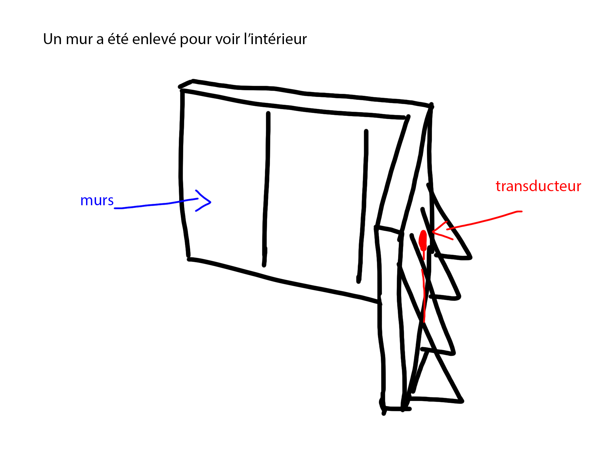
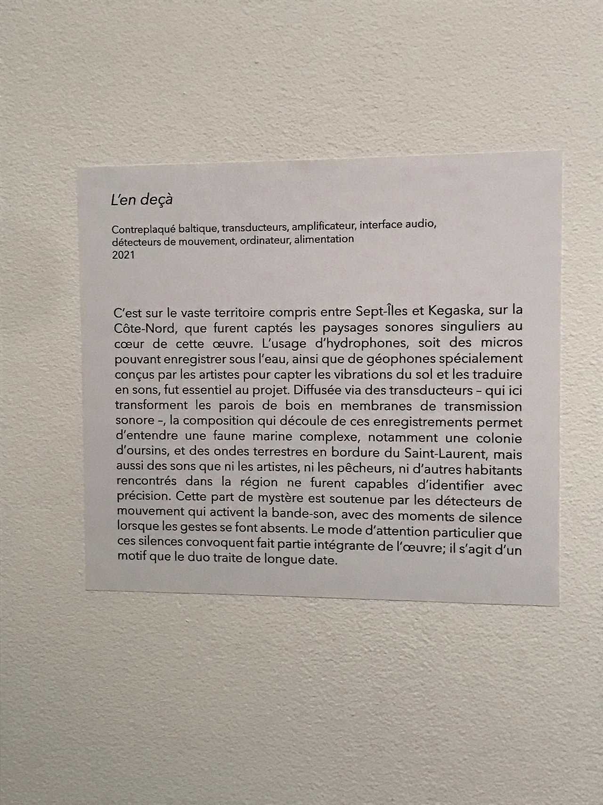
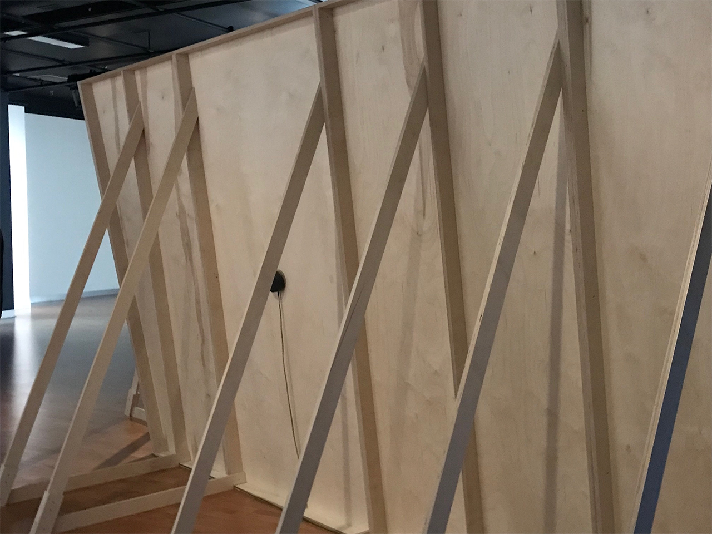
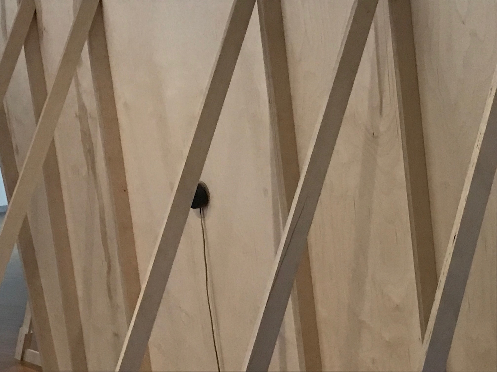
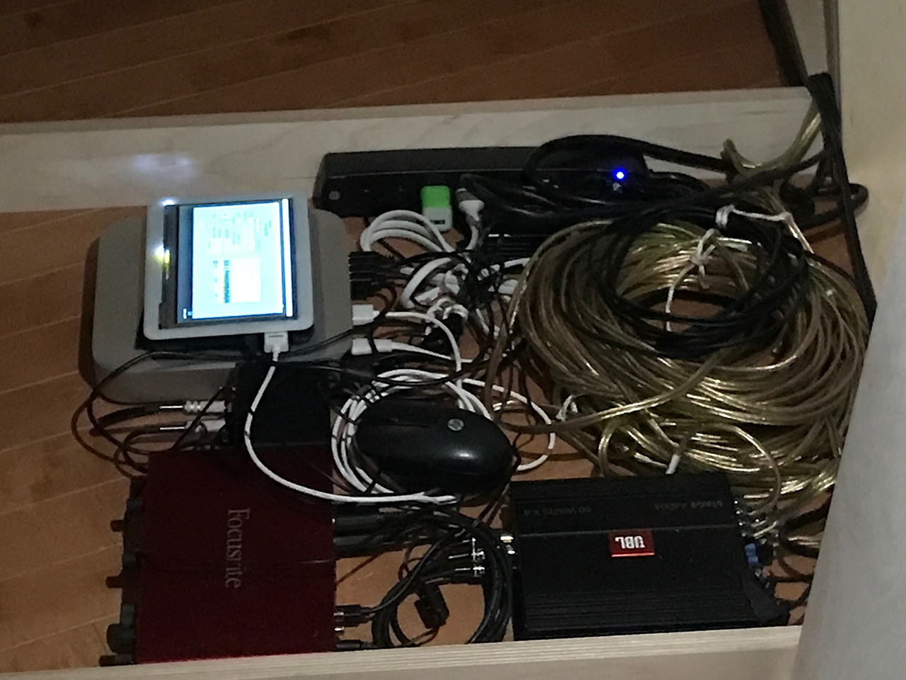
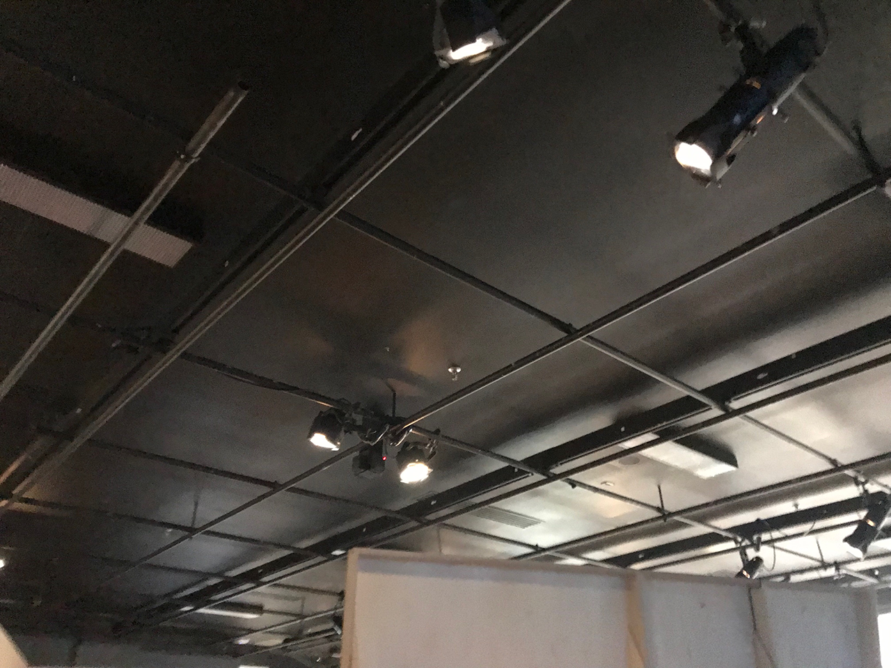
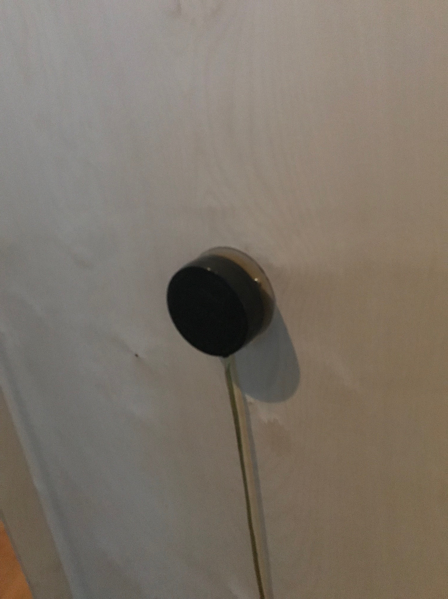
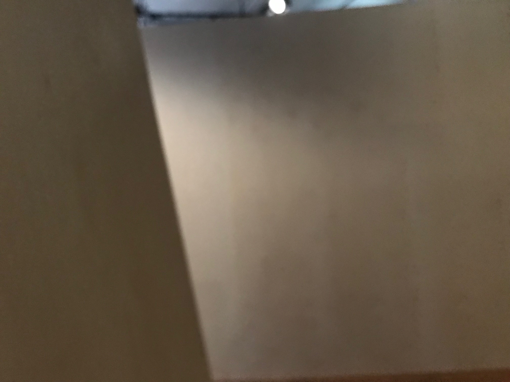
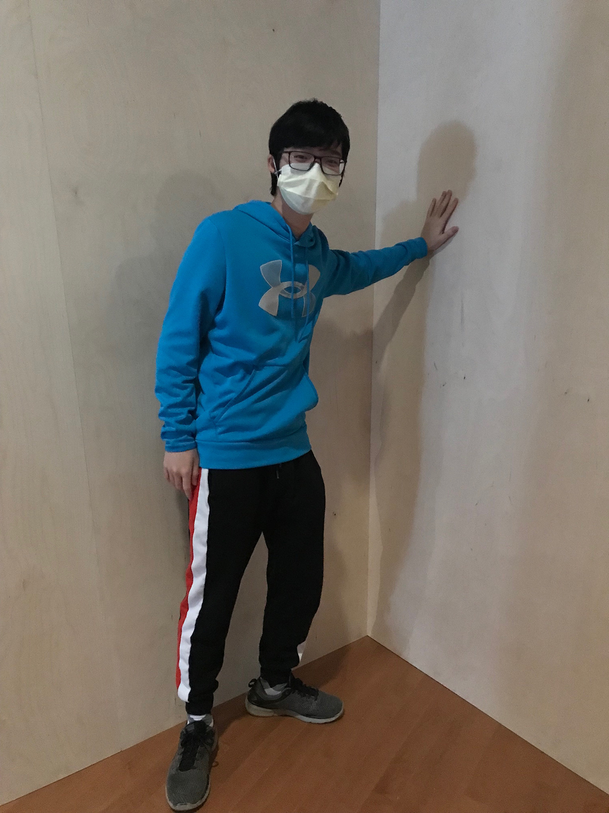

  # L'en deçà

  ## Béchard Hudon

  ## 2021

  ## *Configuration du Sensible*

  ## Maison des Arts de Laval

  ## 16 Mars 2022

  ## Description de l'oeuvre ou du dispositif multimédia
  
  
  C’est sur le vaste territoire compris entre Sept-Îles et Kegaska, sur la Côte-Nord que furent captés les paysages sonores singuliers au cœur de cette œuvre. L’usage d’hydrophones, soit des micros pouvant enregistrer sous l’eau, ainsi que de géophones spécialement conçus par les artistes pour capter les vibrations du sol et les traduire en sons, fut essentiel au projet. Diffusée via des transducteurs – qui ici transforment les parois de bois en membranes de transmission sonore –, la composition qui découle de ces enregistrements permet d’entendre une faune marine complexe, notamment une colonie d’oursins, et des ondes terrestres en bordure du Saint-Laurent, mais aussi des sons que ni les artistes, ni les pêcheurs, ni d’autres habitants rencontrés dans la région ne furent capables d’identifier avec précision. Cette part de mystère est soutenue par les détecteurs de mouvement qui activent la bande-son, avec des moments de silence lorsque les gestes se font absents. Le mode d’attention particulier que ces silences convoquent fait partie intégrante de l’œuvre; il s’agit d’un motif que le duo traite de longue date. 
  
  [Source](https://bechardhudon.com/project/en-deca-2022/)

  ## Explications sur la mise en espace de l'oeuvre ou du dispositif
  Les murs sont placés dans le centre de la salle avec des lumières qui illumine l'oeuvre. Les sons qui sont transmis complémente les autres oeuvres présents.
  
  
  ## Liste des composantes et techniques de l'oeuvre ou du dispositif
  Contreplaqué baltique, transducteurs, amplificateur, interface audio, détecteurs de mouvement, ordinateur, alimentation
  
  
  
  [Source](https://bechardhudon.com/project/en-deca-2022/)

  ##  Liste des éléments nécessaires pour la mise en exposition
  De l'éléctricité et une salle assez grande.
  
  

  ##  Expérience vécue:

  ### Description de votre expérience de l'oeuvre ou du dispositif, de l'interactivité, des gestes à poser, etc.
  J'ai vécue une expérience intéressante avec l'oeuvre parce que de base, elle n'a pas l'air si intrigante ou spéciale comparée aux autres oeuvres présents. Quand j'ai rentré dans la salle, je pensais que c'était une chose en construction, mais quand la guide nous a expliqué les détails de l'exposition ça a capté mon attention. L'utilisation des murs et des transducteurs pour transmettre des sons m'impressionne puisque je n'aurais jamais pensé à ça. Si tu pose ta main sur le mur, tu peut ressentir des vibrations qui correspond au son qui joue.
  

  ### ❤️ Ce qui vous a plu, vous a donné des idées et justifications
  Ce que j'ai aimé le plus  était l'utilisation des sons de la nature, comme les vagues et les vibrations sismiques. Si tu ne sais pas la source des ces sons, ça donne un effet assez mystérieux à l'oeuvre.

  ###  🤔 Aspect que vous ne souhaiteriez pas retenir pour vos propres créations ou que vous feriez autrement et justifications
  Personellement, il n'y a pas vraiment d'aspect majeur que je n'ai pas aimé. La seule chose que je ferais de différent sera de vernir les murs, puisque j'avais une petite peur d'avoir une écharde si je bougeait ma main sur le mur.

  ## Références
   [Source](https://bechardhudon.com/project/en-deca-2022/)

   
