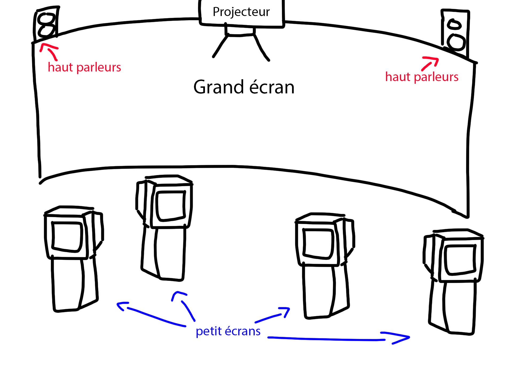
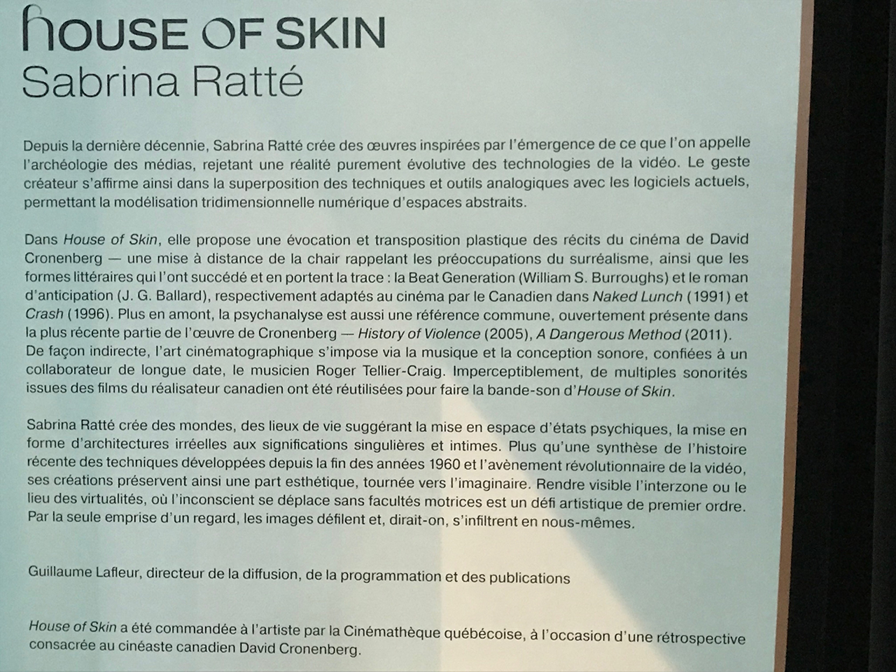
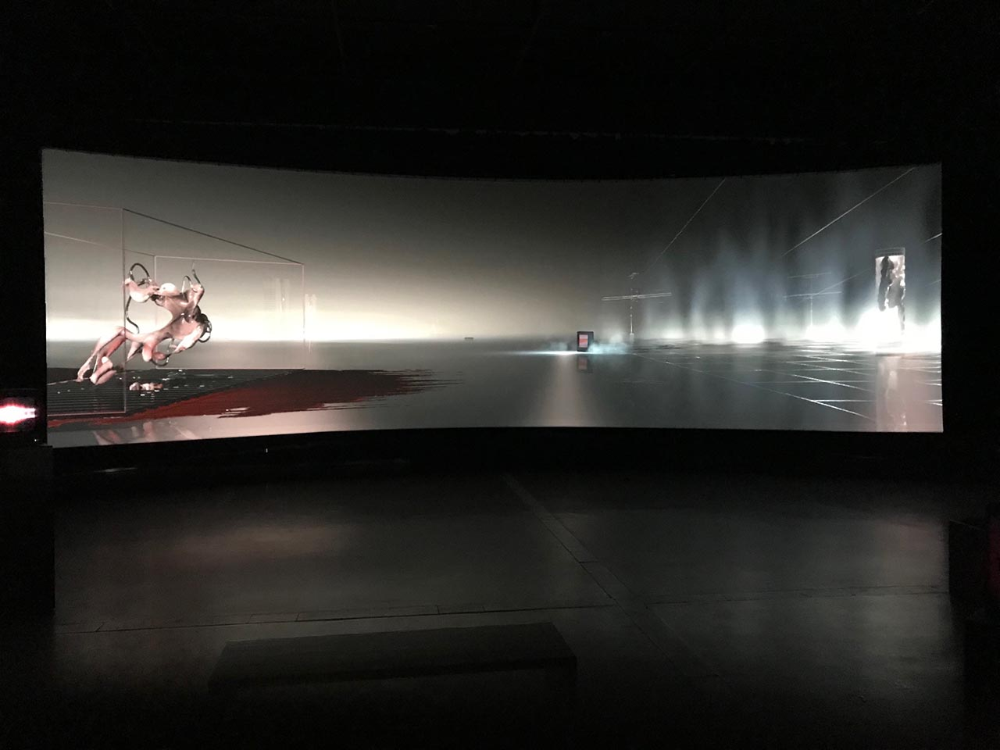
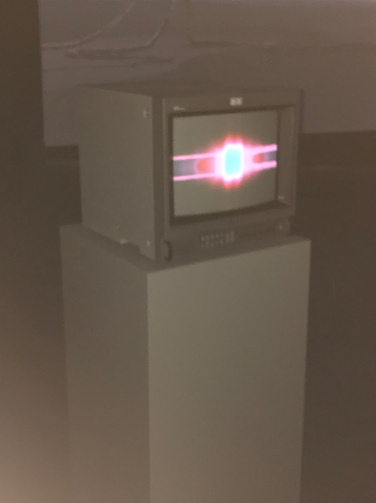
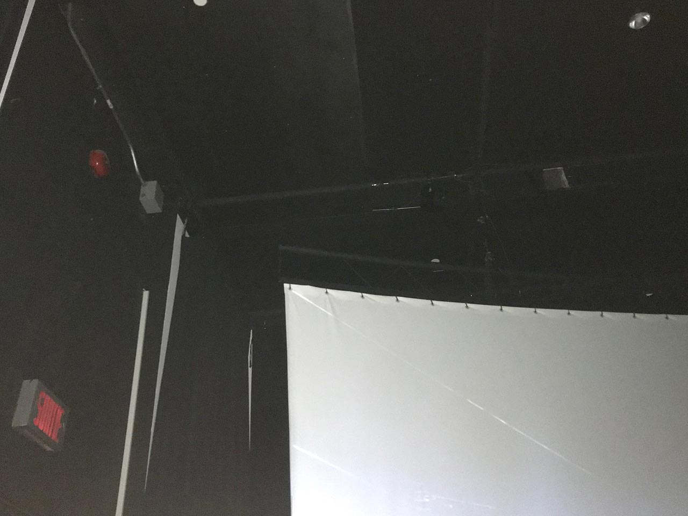
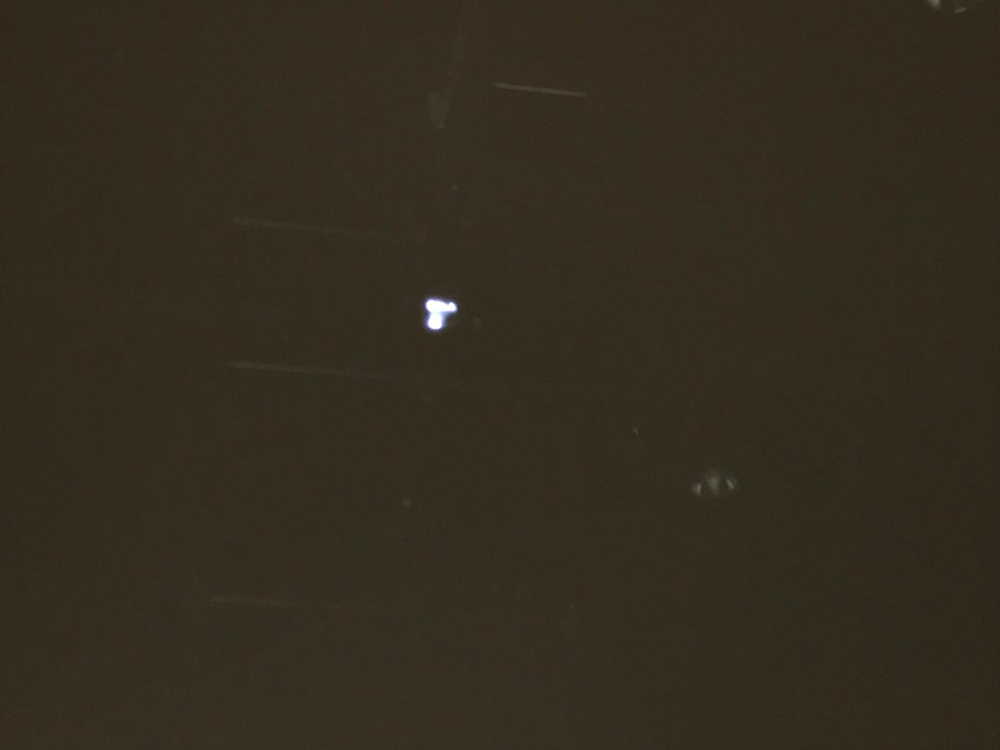
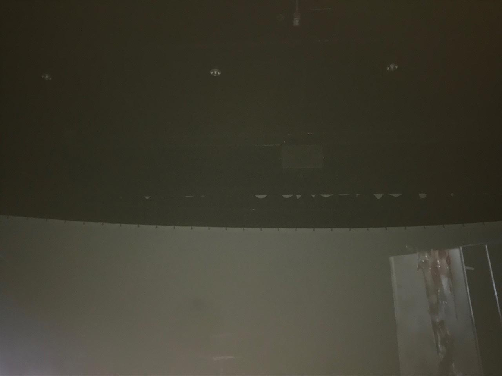
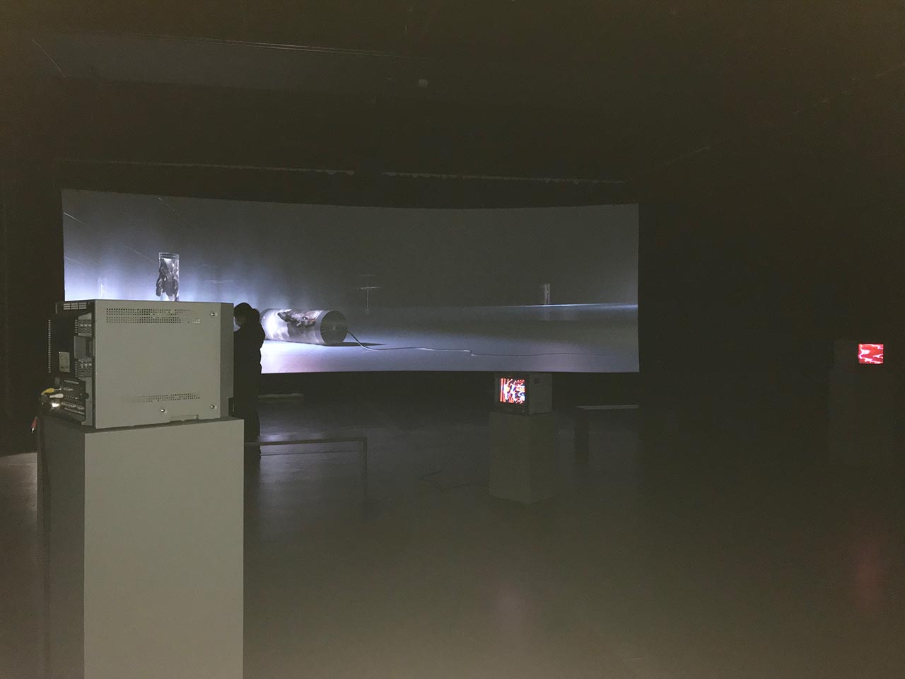
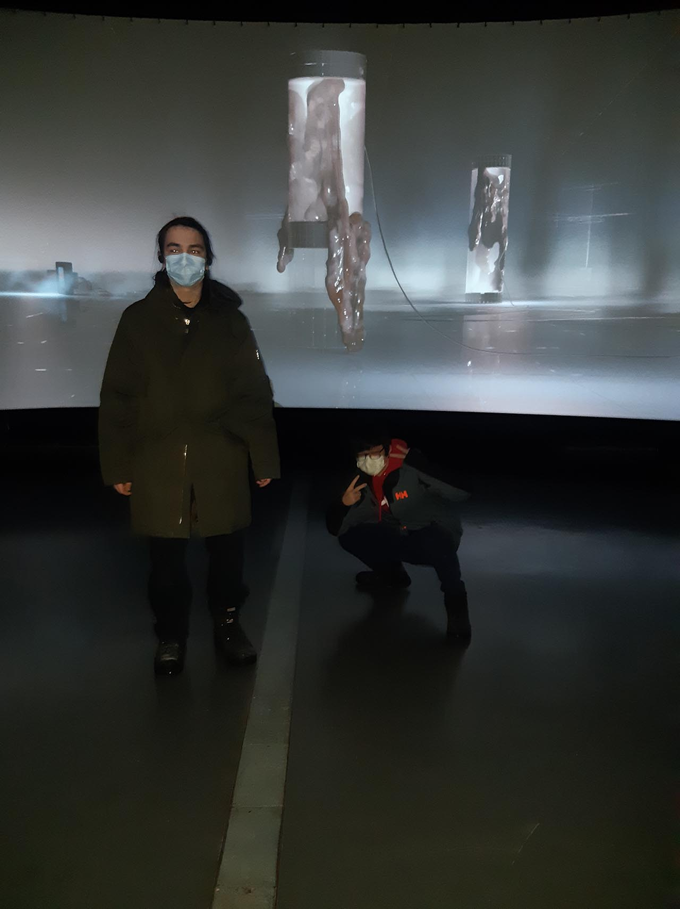

  # Titre de l'oeuvre ou de la réalisation
  House of Skin
  
  ## Nom de l'artiste ou de la firme
  Sabrina Ratté
  
  ## Année de réalisation
  2020

  ## Nom de l'exposition ou de l'événement
  N/A

  ## Lieu de mise en exposition
  Cinémathèque québécoise

  ## Date de votre visite
  2 Mars 2022
  

  ## Description de l'oeuvre ou du dispositif multimédia
  Cette grande installation vidéo est une nature morte où la caméra dévoile lentement des entités charnues intégrées dans de la technologie. Placées dans cet endroit étrange, moitié cimetière moitié cours à déchets, ces mutations obsolètes ont été abandonnées pour créer ce nouveau écosystème suspendu entre la mort et la vie. La forme, texture et contexte sont vaguement basées par différent films de Cronenberg, comme *The fly, Vidéodrome, Dead Ringers, The Brood, Existenz et Crash*. Le titre est une référence au film *Crimes of the Future*.
  
  
  
  
  
  [Source](http://sabrinaratte.com/HOUSE-OF-SKIN-2020)

  ## Explications sur la mise en espace de l'oeuvre ou du dispositif
  Le grand écran est mis sur un mur avec des haut parleurs autour pour faire jouer du son. Les petits écrans sont mis sur des piédestals autours de la salle et éclairent *un peu* la salle.
  
  ^ Haut-parleurs
  
  ^ Oui, ceci est un projecteur.
  

  ## Liste des composantes et techniques de l'oeuvre ou du dispositif
  Haut parleurs, projecteur, écrans (il n'y a pas d'information sur le cartel ou le website donc je me base sur ce que j'ai vu)

  ##  Liste des éléments nécessaires pour la mise en exposition
  Éléctricité, cables de soutien
  
   
  ^ Cables de support

  ##  Expérience vécue:

  ### Description de votre expérience de l'oeuvre ou du dispositif, de l'interactivité, des gestes à poser, etc.
  J'ai vécu une expérience assez décevante parce que il n'y a pas vraiment beaucoup de substance à l'exposition. Je trouve que l'idée est très bonne mais l'éxécution n'était pas si excellente que ça. La noirceur de la salle, le peu de détail dans la vidéo sur le grand écran et la trame sonore accentuait le sentiment de malaise.
  
  
  ### ❤️ Ce qui vous a plu, vous a donné des idées et justifications
  J'ai beaucoup aimé le thème de entités biologiques avec de la technologie de mélangé ensemble. C'est un sujet qui est très commun dans la science fiction mais je trouve que ça a quand même de nombreuses possibilités en art.
  
  ###  🤔 Aspect que vous ne souhaiteriez pas retenir pour vos propres créations ou que vous feriez autrement et justifications
  Ce que j'ai le moin aimé de cette oeuvre est le fait qu'il fait extrêmement noir dans la salle, au point que je ne voyais presque pas les personnes dont j'étais avec. D'ailleurs, c'est pour cela que les photos sont de qualité terrible, le flash de mon téléphone ruine les photos mais je n'avais pas de choix.
  
  
  ^ Moi, à droite
  
  ## Références
  [Source](http://sabrinaratte.com/HOUSE-OF-SKIN-2020)
